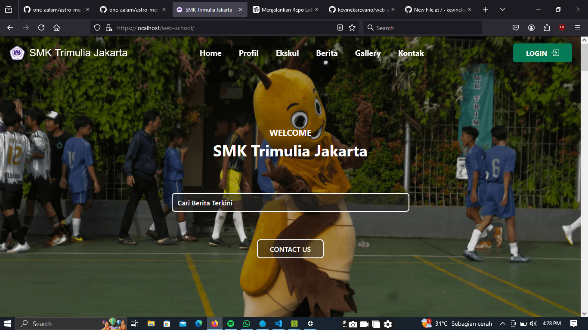
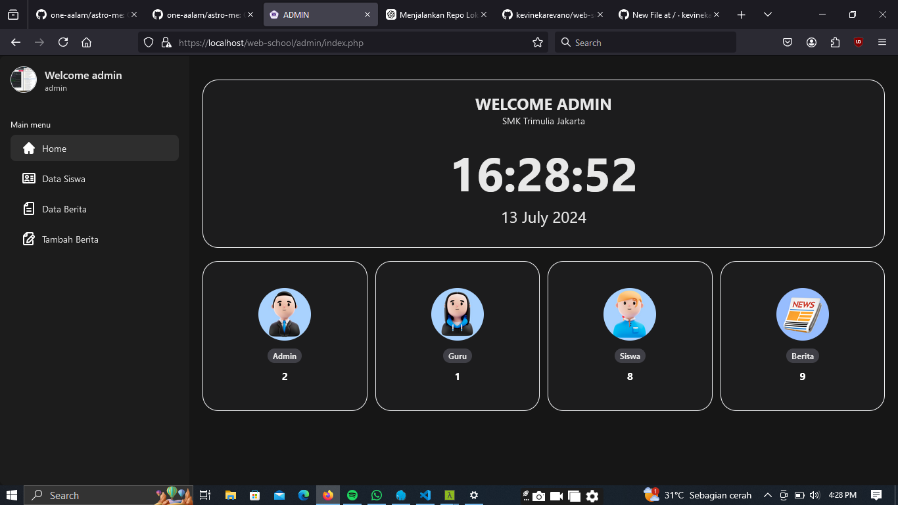

<h1>Web School</h1>

Web Sekolah dengan Content Management System (CMS)

Project ini dibangun dengan framework Tailwind CSS & PHP Native.

## Screenshots




## Akun

### Admin
- **Username:** admin
- **Password:** 123

### Guru
- **Username:** guru
- **Password:** 123

### Murid
- **Username:** 0202
- **Password:** 123

## Fitur
- Login
- Level Akun
- Upload Berita
- Edit Berita
- Hapus Berita

## Coming Soon Features
- System Log mencatat IP, MAC Address
- Perpustakaan
- Sistem upload tugas
- Pannel Pengaturan WEB
  - Manajemen Posting
  - Manajemen Beranda
  - Manajemen Sejarah Sekolah
  - Manajemen Jurusan
  - Manajemen Fasilitas
  - Pengaturan Title, Keyword, Logo, dan warna

## Langkah-langkah Penginstalan
1. Clone repository:
   ```sh
   git clone https://github.com/kevinekarevano/web-school
   cd web-school
